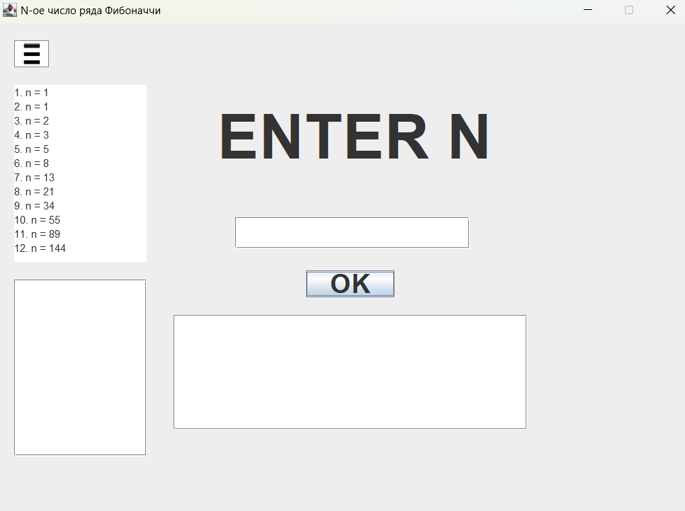

# N-th Fibonacci number

This program calculates the n-th number from the Fibonacci sequence. Below are some examples:

For n = 2, the answer is 1, because the Fibonacci sequence is a series where each successive number is the sum of the previous two numbers, starting from zero.

Then, the Fibonacci sequence is: 1, 1, 2, 3, 5, 8, ..., n<sub>i-1</sub> + n<sub>i</sub>.

For n = 6, the answer is 8, using the same formula.

---

## You can integrate this code into your project and use it as a library to calculate the n-th number of the Fibonacci sequence or to start a UI.
---
### Start with interface
### Compile
```
cd <path_to_directory>
javac -cp . Main.java
```
## Start program
```
java Main
```

Base UI 

(primitive interface(need no explanation))


Expanded interface (tap on top-left burger menu)

Bellow is base place with calculations of the first values



Bellow bellow is user calculating histroy

All history recorded to file history.txt


---
## Integrate to you code

U can integrate calculating class to you program how base calculate by means of static method nthNumFibonacci(long n), he return BigDecimal
Copy this code to u project or download file from this repository
```java
import java.math.BigInteger;

public class Fibonacci {
    public static BigInteger nthNumFibonacci(long n) {

        BigInteger fibonacci;
        BigInteger num1 = new BigInteger("0");
        BigInteger num2 = new BigInteger("1");

        for(int loop = 0; loop < n; loop++) {
            fibonacci = num1.add(num2);
            num1 = num2;
            num2 = fibonacci;
        }

        return num1;
    }
}
```


